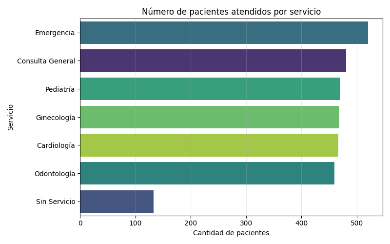
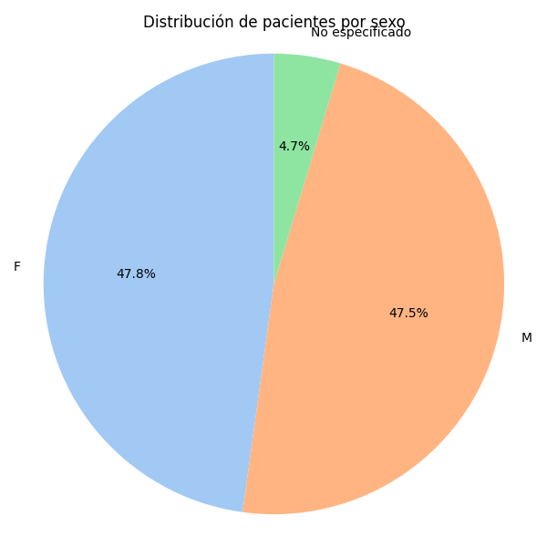
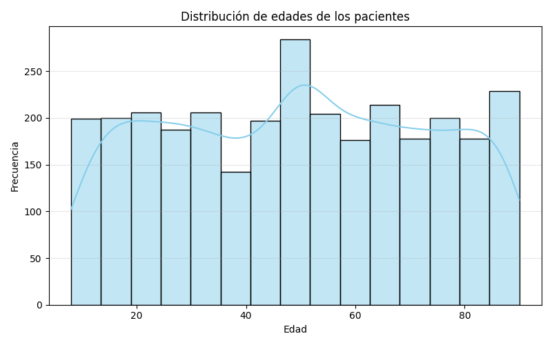
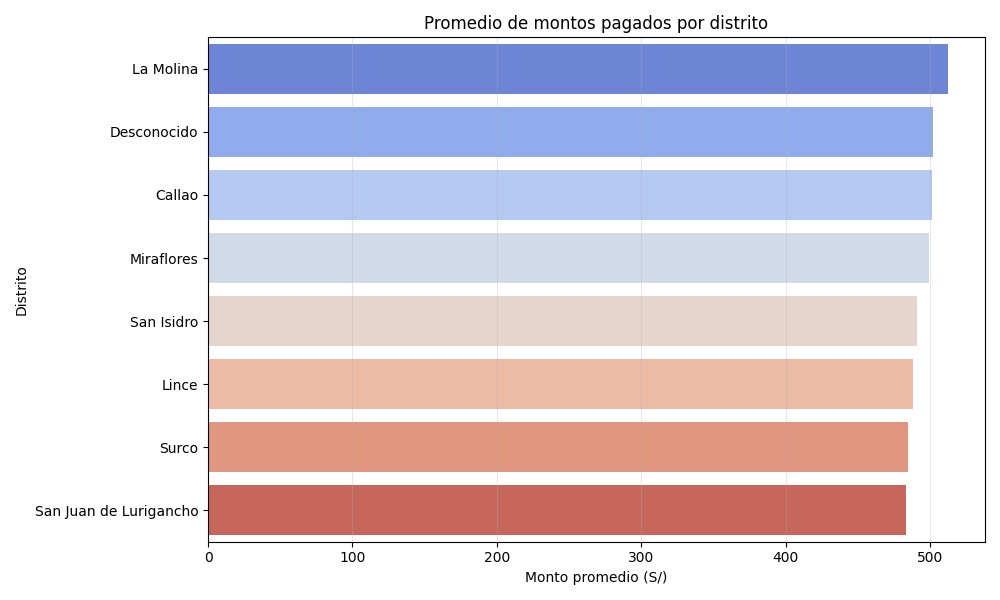

# 🏦 Proyecto Big Data – Análisis de Pacientes, MongoDB y GitHub
## 📘 Descripción General

El proyecto simula un caso real del sector Salud, desde la creación y depuración de datos, hasta su almacenamiento en una base de datos NoSQL y visualización analítica, aplicando buenas prácticas de versionamiento con GitHub e integración continua con Jenkins.

## 🗂️ Estructura del Proyecto

```bash
SaludDigitalB_E1/
│
├── data/
│   └── pacientes.csv
│   └── base.csv
│
├── database/
│   └── pacientes_clean.csv
│
├── reports/
│   └── pacientes_atendidos_por_servicio.png
│   └── distribución_por_sexo.png
│   └── distribución_de_edades.png
│   └── promedio_de_montos_por_distrito.png
│
├── ci/
│   └── job_jenkins1.png
│   └── job_jenkins2.png
│   └── job_jenkins3.png
│   └── job_jenkins4.png
│   └── job_jenkins5.png
│
├── git/
│   └── 1er_commit.png
│   └── 2do_commit.png
│   └── 3er_commit.png
│   └── 4to_commit.png
│   └── 5to_commit.png
│   └── 6to_commit.png
│
├── scripts/
│   └── 1_Crear_Carpetas.ipynb
│   └── 2_Crear_Estructura.ipynb
│   └── 3_Generar_Data_Turismo.ipynb
│   └── 4_Proceso_ETL.ipynb
│   └── 5_Loading_MongoDB.ipynb
│   └── 6_Reportes.ipynb
│
├── README.md

```
##  Conclusiones del Análisis de Datos

1. Distribución de pacientes por servicio



Los servicios con mayor demanda fueron Emergencia y Consulta General, lo que indica que la mayoría de atenciones se concentran en situaciones críticas o generales. El servicio "Sin Servicio" aparece como categoría residual, posiblemente por registros incompletos


2. Distribución de pacientes por sexo



La proporción entre pacientes hombres y mujeres está equilibrada, con una ligera mayoría femenina. Un pequeño porcentaje no especificó su sexo, lo que puede deberse a omisiones en el registro o falta de respuesta.


3. Distribución de edades



La edad de los pacientes se distribuye de forma amplia, con concentraciones entre los 30–40 y 60–70 años. Esto sugiere que los servicios están siendo utilizados tanto por adultos jóvenes como por adultos mayores.


4. Promedio de montos pagados por distrito



Los distritos con mayores montos promedio fueron San Juan de Lurigancho y San Isidro, mientras que Miraflores y La Molina registraron montos más bajos. Esto podría reflejar diferencias en tipo de atención, capacidad de pago o cobertura de servicios.


## 👨‍🏫 Autor

```bash
Proyecto desarrollado aplicando conceptos de Big Data, Vs Code, Python, MongoDB y Jenkins.
Brayam Esmith Alfaro Urtecho
Fecha: 17.10.2025
